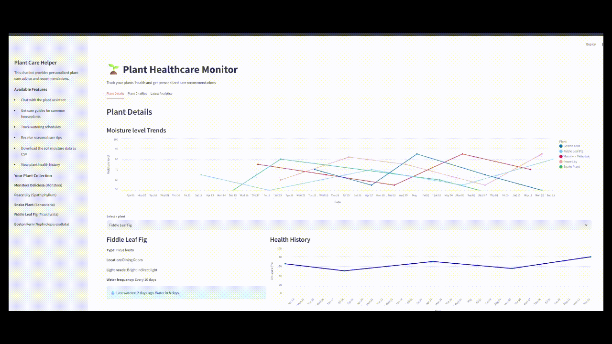

<!DOCTYPE html>
<html lang="en">
<head>
    <meta charset="UTF-8">
    <meta name="viewport" content="width=device-width, initial-scale=1.0">
<!--     <title>Smart Plant Monitoring System</title> -->
</head>
<body>
<h1>AI - Enhanced Smart Plant Monitoring System</h1>

<h2>Overview</h2>

The AI - Enhanced Smart Plant Monitoring System is an IoT-based project designed to monitor and maintain optimal conditions for plant growth.

<h2>Features</h2>
<ul>
    <li>Monitors soil moisture.</li>
    <li>Real-time data monitoring using NodeMCU.</li>
</ul>

<h2>Components Used</h2>
<ul>
    <li>NodeMCU (ESP8266)</li>
    <li>Temperature and Humidity Sensor (DHT11)</li>
    <li>Soil Moisture Sensor</li>
    <li>Connecting Wires and Breadboard</li>
</ul>

<h2>How to Run</h2>
<ol>
    <li>Clone the repository:</li>
    <pre><code>git clone https://github.com/akshayasbipin/PlantCareBot.git</code></pre>
    <li>Upload the Arduino code to the NodeMCU.</li>
    <li>Connect the sensors and the water pump. </li>
    <li>Monitor data in real-time through the connected device.</li>
    <pre><code>streamlit run code_v6.py</code></pre>
</ol>
  <h1>Demo video</h1>
  <table>
              <tr>
                  <td></td>
              </tr>
          </table>

<!-- <h2>License</h2>

This project is licensed under the MIT License.
 -->
</body>
</html>
